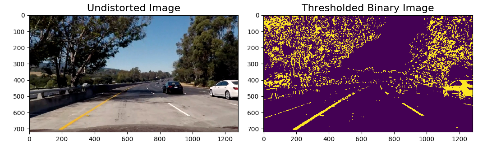

## **Udacity Project: Advanced Lane Finding**
---
#### README
**Advanced Lane Finding**

The goals / steps of this project are the following:
* Compute the camera calibration matrix and distortion coefficients given a set of chessboard images.
* Apply a distortion correction to raw images.
* Use color transforms, gradients, etc., to create a thresholded binary image.
* Apply a perspective transform to rectify binary image ("birds-eye view").
* Detect lane pixels and fit to find the lane boundary.
* Determine the curvature of the lane and vehicle position with respect to center.
* Warp the detected lane boundaries back onto the original image.
* Output visual display of the lane boundaries and numerical estimation of lane curvature and vehicle position.

#### [Rubric Points](https://review.udacity.com/#!/rubrics/571/view)
Here I will consider the rubric points individually and describe how I addressed each point in my implementation.  

---
#### File Submission (Implementation in Python)

My project includes the following files:

* **MachineVision.py** - containing the following classes and functions:( Note: `MachineVision` imported as `Mv` )   

** [1] Class for Camera Calibration, Image Undistortion & Perspective Transformation**
```
class ImageGeometric:
    draw_chessboard_corners()
    calibrate_and_undistort()
    warp_image_to_top_down_view()
```
** [2] Functions to Apply Mask of Color Thresholds & Gradient Threholds**
```
Global functions under MachineVision.py:
    get_mask_color_threshold()
    get_mask_gradient_thresholds()
```
** [3] Class for Lane Detection **
```
class Line:
    update_status()
class LaneDetector:
    find_lane_base()
    scan_entire_image_for_lane()
    scan_partial_image_for_lane()
    find_lane_lines()
```
** [4] Functions to visualize results  **
```
    show_histogram_for_lane_base()
    get_ploty_of_detected_lane()
    visualize_detected_lane()
    draw_lane_on_org_image()
    show_data_on_org_image()
```
** [5] Functions to sanity check, and measure curvature & center offset  **
```
    check_lane_sanity()
    measure_curvature_n_center_offset()
```

* **ProcessImages.py** - the program in this file utilizes the functions in MachineVision.py to process those example images given in Folder ```./test_images```. The processed images are stored at ```./output_images```
  
* **ProcessVideo.py** - the program in this file utilizes the functions in MachineVision.py to process Video ```project_video.mp4``` and generate the lane-marked video ```project_video_lane_marked.mp4```
  
* **./output_images/xxx/xxx.jpg** - images for demo, after ```./test_images/*.*``` processed by ```ProcessImages.py```
  
* **./project_video_lane_marked.mp4**, video for demo, after ```project_video.mp4``` processed by ```ProcessVideo.py```

---
#### Camera Calibration - Computation of Camera Matrix and Distortion Coefficients

For the code of this step, refer to `ProcessImages.py - Code Section "[1] Camera Calibration"`

I start by preparing "object points", which will be the (x, y, z) coordinates of the chessboard corners in the world. Here I am assuming the chessboard is fixed on the (x, y) plane at z=0, such that the object points are the same for each calibration image.  Thus, `objp` is just a replicated array of coordinates, and `objpoints` will be appended with a copy of it every time I successfully detect all chessboard corners in a test image.  `imgpoints` will be appended with the (x, y) pixel position of each of the corners in the image plane with each successful chessboard detection.  

I then used the output `objpoints` and `imgpoints` to compute the camera calibration and distortion coefficients using the `cv2.calibrateCamera()` function.  I applied this distortion correction to the test image using the `cv2.undistort()` function and obtained this result: 


Input Images @ `./camera_cal/`  
Output Images @ `./output_images/chessboard_corner/`  

---
### Pipeline (single images)

#### 1. Distortion Correction 

After applying `cv2.calibrateCamera()` function to calibrate the camera (as stated above in description of Camera Calibration), I applied `cv2.undistort() to correct distortion of the image.

See Code:  
`MachineVision.py - ImageGeometric.calibrate_and_undistort()`  
`ProcessImages.py - [2.1] Undistort road images based on the calibrated Camera`

Output Images located at:  
`./output_images/undistorted_images/` and `./output_images/all/`

**Example of distortion-corrected image(generated from test5.jpg):** 


---
#### 2. Creation of Thresholded Binary Image: Color transforms & Gradients Applied

In order to filter out the unwanted information in the image and hightlight the lane lines, an OR combination of color thresholds and gradient thresholds are used to generate a binary image. 

(1)For color threshold mask - the Hue Channel and Saturation Channel of HLS Color Space, and Red and Green Channel of RGB Color Space and utilized to generate a color mask:  
`combined_thresholds[( ((R_mask==1)&(G_mask==1)) | ((H_mask==1)&(S_mask==1)) )] = 1`

(2)For gradient threshold mask - X-axis gradient, direction gradient and magnitude gradient are applied with the following combination:
`combined_thresholds[ ((gradx == 1)) | ((mag_binary == 1)&(dir_binary == 1)) ] = 1`

`Final Threshold Mask == (1) OR (2)`

**Example of thresholded binary image(generated from test5.jpg):** 


See Code:  
`MachineVision.py - get_mask_color_threshold() and get_mask_gradient_thresholds()`  
`ProcessImages.py - [2.2] Create thresholded binary image from the undistort road images`  

Output Images located at:  
`./output_images/binary_images/` and `./output_images/all/`

---
#### 3. Perspective Transform 

In order to achieve top-down view on the road (which is helpful for lane curve radius analysis later), perspective transform is performed on each image. Specifically, Open CV function `cv2.getPerspectiveTransform` is utilized to generate transformation matrix, while `cv2.warpPerspective` is employed to warp a image with the above matrix .
  
The hardcoded source and destination points are chosen in the following manner:

```python
x_offset = 230
y_offset = 20

#Coordinate Format: [top left, top right, bottom left, bottom right]
src = np.float32([(580,450),
                  (700,450), 
                  (145,670), 
                  (1135,670)])
                  
dst = np.float32([(x_offset,        y_offset),
                  (width-x_offset,  y_offset),
                  (x_offset,        height-y_offset),
                  (width-x_offset,  height-y_offset)])
```
  
This resulted in the following source and destination points:

| Source        | Destination   | 
|:-------------:|:-------------:| 
| 580, 450      | 230, 20       | 
| 700, 450      | 1050, 20      |
| 145, 670      | 230, 700      |
| 1135, 670     | 1050,700      |

The perspective transform was verified to be working as expected, by drawing the `src` and `dst` points onto a test image and its warped counterpart to verify that the lines appear parallel in the warped image. 

**Below is an example(generated from test5.jpg):** 


See Code:  
`MachineVision.py - warp_image_to_top_down_view()`  
`ProcessImages.py - [2.3] Warp the undistort road images & thresholded binary images`  

Output Images located at:  
`./output_images/warped_images/`  
`./output_images/warped_binary_images/`  
`./output_images/all/`  

---
#### 4. Identifying Lane-line Pixels & fitting Pixels with Polynomial

In order to identify lane line pixels and also fits these pixels with a polynomial, 
"Sliding Window Search based on histogram analysis" approach is utilized:  
* 1) Open an binary warped image  
* 2) Computed the histogram on the lower half of the image  
* 3) Determine left and right base pixels according to the peaks of the histogram and calculation of midpoint of the image  
* 4) Seperate the image in 9 sections(customizable) vertically.  
* 5) Iterate for each section from bottom of the image to the top of the image  
    (5-1) Apply two "windows"(with its size and margin customizable) for each section, one for left half of image and the other for the right half. A window position  should be near and above the right/left line base or the previous detected part of right/left line  
    (5-2) Find in a "window" where most of pixels with value "1" are clustered on the left half of the image and the right half. Mark the middle of the two "hot" pixel sections (left and right) as a part of left line and a part of right line, respectively.  
* 6) Use NumPy Function "np.polyfit()" to get a polynomial which fits the left pixels well  
* 7) Use NumPy Function "np.polyfit()" to get a polynomial which fits the right pixels well 
    as a starting point  

**Below is an example(generated from test5.jpg)**:

        
See Code:  
`MachineVision.py - LaneDetector.scan_entire_image_for_lane()`  
`MachineVision.py - visualize_detected_lane()`  
`ProcessImages.py - [2.4] Detect lane in the warped images, and draw lane onto the original images`  

Output Images located at:  
`./output_images/lane_marked_images/` and `./output_images/all/`

---
#### 5. Calculation of Lane Curvature Radius and Vehicle Position 

To calculate the lane curvature radius and the position of the vehicle with respect to lane center, 
the function `measure_curvature_n_center_offset() in MachineVision.py` in created and utilized in `ProcessImages.py - [2.4] Detect lane in the warped images, and draw lane onto the original images`

**Below is an example(generated from test5.jpg)**:


Output Images located at:  
`./output_images/final_lane_images/` and `./output_images/all/`

---
#### 6. Provide an example image of your result plotted back down onto the road such that the lane area is identified clearly.

Curvature radius display and lane marking on the original images is implemented in the following functions:  
`MachineVision.py - draw_lane_on_org_image()`  
`MachineVision.py - show_data_on_org_image()`  

**Below is an example(generated from test5.jpg)**:


---

### Pipeline (video)

#### 1. Provide a link to your final video output.  Your pipeline should perform reasonably well on the entire project video (wobbly lines are ok but no catastrophic failures that would cause the car to drive off the road!).

Here's the link to the demo video for lane detection: 
[](project_video_lane_marked.mp4)

---
### Visualization of Pipeline Steps 


---
### Discussion

#### 1. Known Issue and Limitation of the Pipeline
* (1) Jittery motion of the lines is noticed especially in the "challenge" video
* (2) Detection failure possibly happens in either dark conditions or insufficient contrast conditions
The algoritm may need to be improved with better fine-turned parameters and other extra tactics applied

#### 2. Possible Improvements to the Pipeline
* (1) Apply time-factor-considered weighted average to the generated right lane line and left lane line during a certain timespan, to avoid sudden appearance or vanishing of the drawn lane lines, so as to reduce their jittery motion
* (2) Pending work for future: To make the pipeline more robust, need to finalize the sanity check by completing the function done in half way: "check_lane_sanity()" and "line.update_status()" 
* (3) Implement a mechanism to reduce the searching area of lane line pixels in subsequent frames of video to speed up the processing

